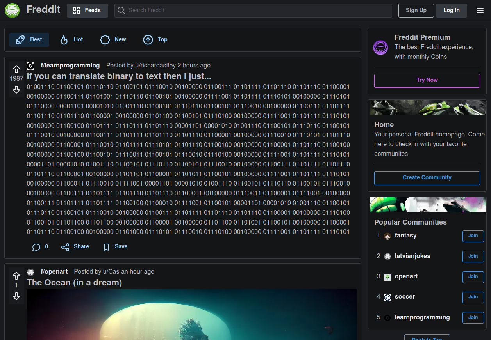

# Freddit (social forum app)

A social forum app with the basic features of Reddit. Built with Typescript, NextJS, Redux Toolkit & Mantine

[Demo here](https://forum-app-hazel.vercel.app/)



### Installing and running locally

```bash
git clone git@github.com:Casssb/forum-app.git
cd forum-app
npm install
npm run dev
```
### Firebase setup
- Create a Firebase project
  - Go to [Firebase](https://firebase.google.com/) &rarr; Get Started &rarr; Add project
- Register your app
  - Go to Project overview &rarr; Choose </> (Web App)
- Enable Authentication
  - Go to Authentication &rarr; Get Started &rarr; Sign-in method &rarr; Enable Google &rarr; Enable Email/Password
- Enable Firestore
  - Go to Firestore Database &rarr; Create database
- Enable Storage
  - Go to Storage &rarr; Enable storage
- Setup project
  - Go to Project settings &rarr; General &rarr; Your apps &rarr; SDK setup and configuration &rarr; Config
  - Create a .env.local file in project's root directory
  - Paste code below and provide your keys found in Config

```
NEXT_PUBLIC_API_KEY=
NEXT_PUBLIC_AUTH_DOMAIN=
NEXT_PUBLIC_PROJECT_ID=
NEXT_PUBLIC_STORAGE_BUCKET=
NEXT_PUBLIC_MESSAGING_SENDER_ID=
NEXT_PUBLIC_APP_ID=
NEXT_PUBLIC_MEASUREMENT_ID=
```

## Tech Used
* React & NextJS
* Firebase for auth, back-end database and cloud storage
* Redux for app global state management
* Mantine for styling (also for general hooks & form validation)
* React-Firebase-Hooks (very useful for auth especially)

## Features
* Full email/password and Google authorisation
* Users can create communities, create and delete posts & comments, and vote on posts.
* NextJS server-side rendering for the basic community markup.
* Dark/light mode options using Mantine hooks
* Responsive on PC, Tablet & Mobile

## Thoughts
* Overall I really like NextJS. It's an opinionated framework but I've found that all of the opinions it has are either my preferred option (routing and handling API's) or decent (CSS modules). I didn't end up using Next 13 experimental features (with the auto server components and App folder) but found the Image module was awesome! Although I didn't end up using my own API routes for this project (I used Firebase), I did mess around with building a few with Prisma, React Query and an SQL database and it was amazingly hassle free.
* I watched a few tutorials on people building their own Reddit, Twitter & Instagram clones and also read a fair bit about the data modelling Reddit actually uses. I've learned a lot about saving time & space complexity by building smaller 'snippet' data sets into each instance of a 'user' instead of keeping everything in single, multi dimensional collections (and therefore having to leverage more time complexity when creating searching algorithms and database queries). 

## Possible Improvements/Todos
* The filter component is just for show at the moment. I may add the option to both sort by date & votes (this can be handled with local state without the need to create further server queries). Any further sorting would be far more complex.
* The new post section only has the option for text & media posts currently. I may add the option for a link post (very straightforward). Adding the logic for a poll will take a fair bit more work (I may do this but have a few other projects I'd like to work on).
* There is no logic to vote on comments (only posts). I may add this since it's just a repetition of the existing logic. I could more or less copy the usePosts hook and replace the Firebase calls with a comments collection.
* There is probably an opportunity to make better use of Next's server side rendering (and possibly incremental static rendering).
* Lighthouse reports that the initial payload coming back from Firebases auth functions is causing the site to run slowly. After reading about this a fair bit on Stack & Reddit I can't quite tell if this is a genuine problem or more of an issue with Lighthouse but it's something to look into.

## Credits
* All art created directly by [Midjourney](https://midjourney.com/home/?callbackUrl=%2Fapp%2F) or [Stable Diffusion](https://stablediffusionweb.com/) (or taken from [OpenArt](https://openart.ai/) but still made by Midjourney or Stable Diffusion)

