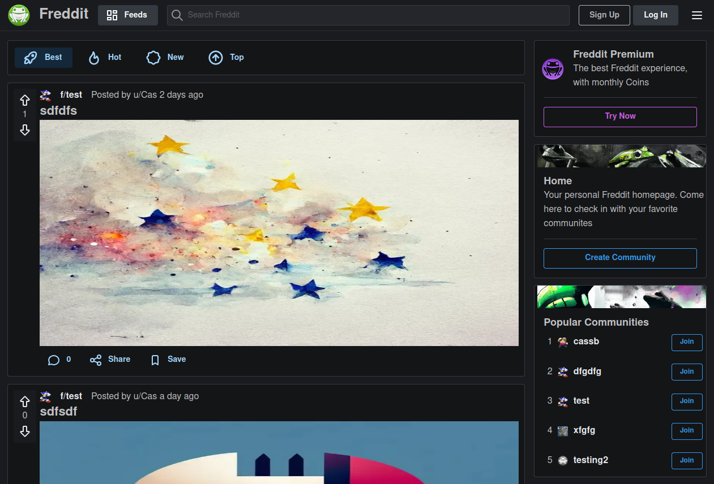

 # Freddit (social forum app)

A social forum app with the basic features of Reddit. Built with Typescript, NextJS, Redux Toolkit & Mantine

[Demo here](https://forum-app-hazel.vercel.app/)



### Installing and running locally

```bash
git clone git@github.com:Casssb/forum-app.git
cd forum-app
npm install
npm run dev
```

## Tech Used
* React & NextJS
* Firebase for auth, back-end database and cloud storage
* Redux for app global state management
* Mantine for styling (also for general hooks & form validation)
* React-Firebase-Hooks (very useful for auth especially)

## Features
* Full email/password and Google authorisation
* Users can create communities, create and delete posts & comments, and vote on posts.
* NextJS server-side rendering for the basic community markup.
* Dark/light mode options using Mantine hooks
* Responsive on PC, Tablet & Mobile

## Thoughts


## Possible Improvements


## Credits
* All art created directly by [Midjourney](https://midjourney.com/home/?callbackUrl=%2Fapp%2F) or [Stable Diffusion](https://stablediffusionweb.com/) (or taken from [OpenArt](https://openart.ai/) but still made by Midjourney or Stable Diffusion)
